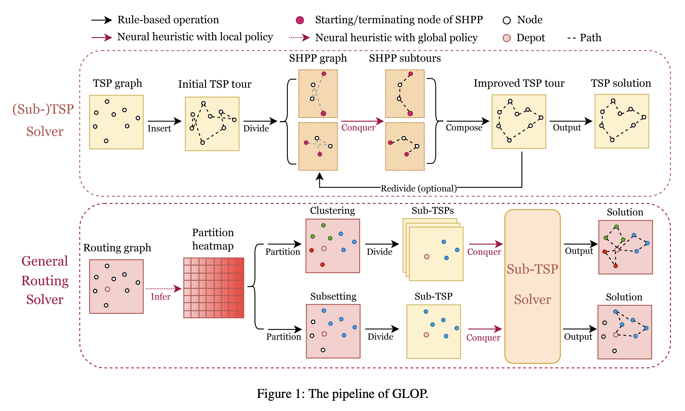

# [AAAI 2024] GLOP: Learning Global Partition and Local Construction for Solving Large-scale Routing Problems in Real-time

**Welcome!** This repository contains the code implementation of paper [*GLOP: Learning Global Partition and Local Construction for Solving Large-scale Routing Problems in Real-time*](https://arxiv.org/abs/2312.08224). GLOP is a unified hierarchical framework that efficiently scales toward large-scale routing problems. It partitions large routing problems into Travelling Salesman Problems (TSPs) and TSPs into Shortest Hamiltonian Path Problems (SHPPs). We hybridize non-autoregressive neural heuristics for coarse-grained problem partitions and autoregressive neural heuristics for fine-grained route constructions.



---

## News
🚀 Oct 2024: We released a [Python library](https://github.com/Furffico/random-insertion) for performing fast random insertion on TSP and SHPP instances

🐛 Jul 2024: Thanks to [Wenzheng Pan](https://github.com/wzever), we detected a [bug](https://github.com/henry-yeh/GLOP/pull/3) in the insertion for ATSP and fixed it. After the bug fix, GLOP achieves better performance on ATSP; see the below table for the updated results. Results on other problems are unaffected.

Version|ATSP150|ATSP250|ATSP1000
-|-|-|-
Before| 1.89 (6.4s) | 2.10 (9.6s) | 2.79 (39s)
After| 1.89 (8.2s) | 2.04 (9.3s) | 2.33 (15s)

---

## Highlights

- Hybridizing **non-autoregressive** solvers for problem partitions and **autoregressive** solvers for solution constructions.
- Competitive performance across large-scale **TSP, ATSP, CVRP, and PCTSP**.
- State-of-the-art scalability and efficiency: reasonable solutions for **TSP100K**, etc.

---

## Dependencies

- Python>=3.8
- NumPy 1.23
- PyTorch 1.13.0
- [PyTorch Scatter](https://github.com/rusty1s/pytorch_scatter) 2.0.7
- [PyTorch Sparse](https://github.com/rusty1s/pytorch_sparse) 0.6.9
- [PyTorch Geometric](https://github.com/pyg-team/pytorch_geometric) 2.0.4
- SciPy
- tqdm

---

## How to Use

### Resources

- Download checkpoints from [checkpoints-downloading-link](https://drive.google.com/file/d/1u9-GVTMRux3rWGcbipSqyTyBx_V8pm9G/view?usp=sharing) and place them in `./pretrained`.

- Download test datasets from [test-datasets-downloading-link](https://drive.google.com/file/d/1WuICJGKRsiTjVTq7_ivh29wWShv8BRBO/view?usp=sharing) and place them in `./data`.

### Evaluation 
To evaluate our method on your own datasets, add `--path PATH_OF_YOUR_DATASET`.

#### For TSP
```bash
# For TSP500:
python main.py --problem_size 500 --revision_iters 20 25 5 --revision_lens 100 50 20 --width 10 --eval_batch_size 64 --val_size 128 --decode_strategy greedy

# For TSP1000:
python main.py --problem_size 1000 --revision_iters 20 25 5 --revision_lens 100 50 20 --width 10 --eval_batch_size 32 --val_size 128 --decode_strategy greedy

# For TSP10k:
python main.py --problem_size 10000 --revision_iters 50 25 5 --revision_lens 100 50 20 --width 1 --eval_batch_size 16 --val_size 16 --decode_strategy greedy

# For TSP100k:
python main.py --problem_size 100000 --revision_iters 50 25 5 --revision_lens 100 50 20 --width 1 --eval_batch_size 1 --val_size 1 --decode_strategy greedy

# To conduct cross-distribution evaluation, e.g.:
python main.py --problem_size 100 --revision_lens 100 50 20 10 --revision_iters 20 10 10 5 --width 140 --eval_batch_size 100 --val_size 10000 --decode_strategy sampling --path data/tsp/tsp_uniform100_10000.pkl --no_aug --no_prune

# To reproduce the results of 49 TSPLib instances:
python eval_tsplib.py --eval_batch_size 1 --val_size 49 --path data/tsp/tsplib49.pkl --width 128 --decode_strategy greedy --no_prune
```


To reduce the inference duration, try:
```bash
# set
--width 1
# add
--no_aug
# less revisions, e.g.,
--revision_iters 5 5 5
```

#### For ATSP

Please refer to `./eval_atsp/`


#### For CVRP

```bash
# For CVRP1K using LKH-3 as sub-solver: 
python eval_cvrp.py --cpus 12 --problem_size 1000

# For CVRP1K using neural sub-TSP solver
python main.py --problem_type cvrp --problem_size 1000 --revision_lens 20 --revision_iters 5

# For CVRP2K using LKH-3 as sub-solver: 
python eval_cvrp.py --cpus 12 --problem_size 2000

# For CVRP2K using neural sub-TSP solver
python main.py --problem_type cvrp --problem_size 2000 --revision_lens 50 20 --revision_iters 5 5

# For CVRP5K using LKH-3 as sub-solver
python eval_cvrp.py --cpus 12 --problem_size 5000 --ckpt_path pretrained/Partitioner/cvrp/cvrp-2000.pt

# For CVRP5K using neural sub-TSP solver
python main.py --problem_type cvrp --problem_size 5000 --ckpt_path pretrained/Partitioner/cvrp/cvrp-2000.pt --revision_lens 20 --revision_iters 5

# For CVRP7K using LKH-3 as sub-solver
python eval_cvrp.py --cpus 12 --problem_size 7000 --ckpt_path pretrained/Partitioner/cvrp/cvrp-2000.pt

# For CVRP7K using neural sub-TSP solver
python main.py --problem_type cvrp --problem_size 7000 --ckpt_path pretrained/Partitioner/cvrp/cvrp-2000.pt --revision_lens 20 --revision_iters 5

# For CVRPLIB using LKH-3 as sub-solver
python eval_cvrplib.py

# For CVRPLIB using neural sub-TSP solver
python eval_cvrplib_neural.py
```


#### For PCTSP

```bash
# e.g., for PCTSP500
python main.py --problem_type pctsp --problem_size 500 --n_subset 10 --eval_batch_size 50 --val_size 100 --revision_iters 10 10 5 --revision_lens 100 50 20

# set n_subset = 1 for greedy mode
--n_subset 1
```


### Training

Please refer to READMEs in `./local_construction/` and `./heatmap/*/`.

---

## Citation

🤩 If you encounter any difficulty using our code, please do not hesitate to submit an issue or directly contact us!

😍 If you do find our work helpful (or if you would be so kind as to offer us some encouragement), please consider kindly giving a star, and citing our paper.

```bibtex
@inproceedings{ye2024glop,
  title={GLOP: Learning Global Partition and Local Construction for Solving Large-scale Routing Problems in Real-time},
  author={Ye, Haoran and Wang, Jiarui and Liang, Helan and Cao, Zhiguang and Li, Yong and Li, Fanzhang},
  booktitle={Proceedings of the AAAI Conference on Artificial Intelligence},
  year={2024},
}
```


## Acknowledgements

* [Attention, learn to solve routing problems!](https://github.com/wouterkool/attention-learn-to-route)
* [Learning Collaborative Policies to Solve NP-hard Routing Problems](https://github.com/alstn12088/LCP)
* [Generalize a small pre-trained model to arbitrarily large TSP instances](https://github.com/Spider-scnu/TSP)
* [Learning generalizable models for vehicle routing problems via knowledge distillation](https://github.com/jieyibi/AMDKD)
* [Matrix Encoding Networks for Neural Combinatorial Optimization](https://github.com/yd-kwon/MatNet)
